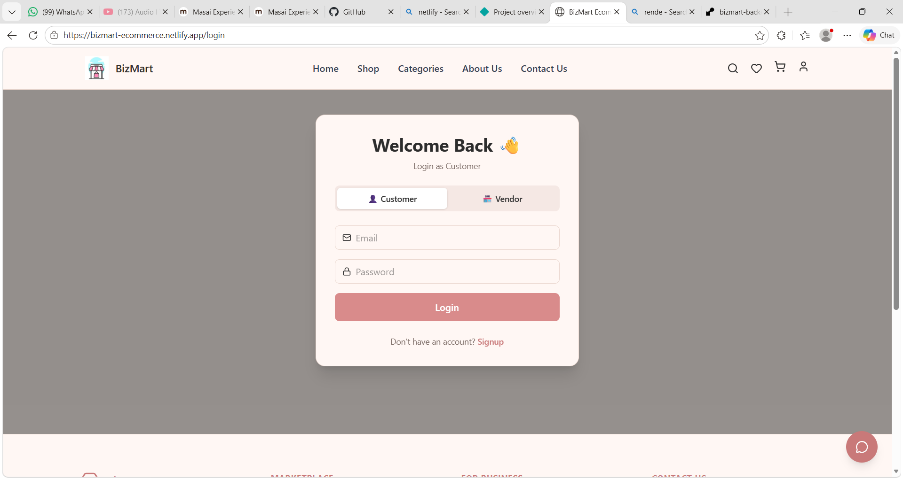
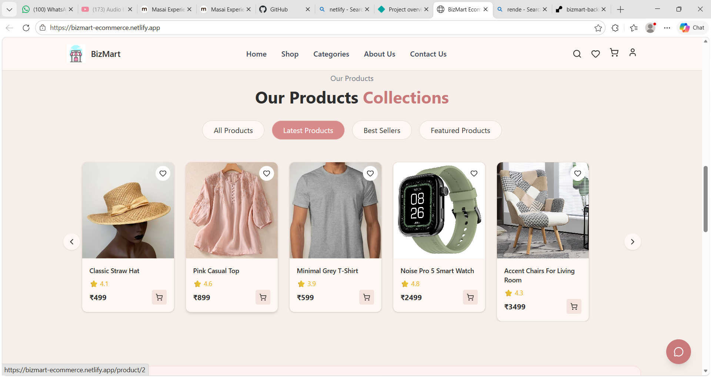
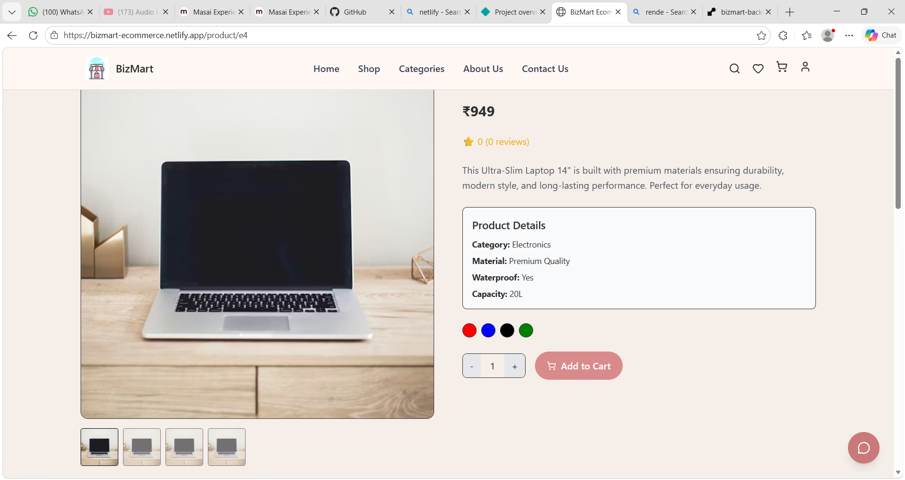
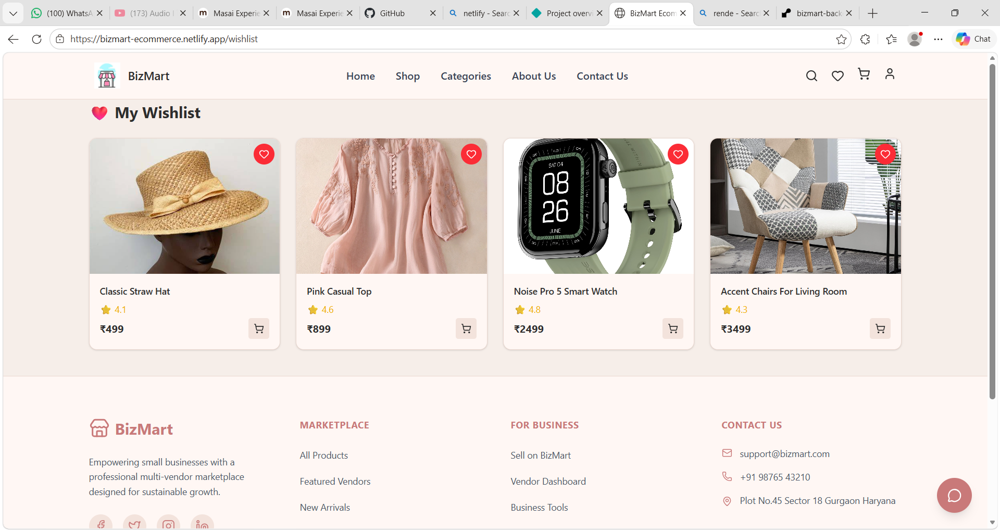
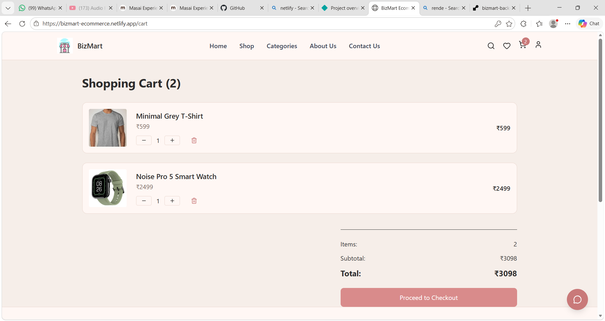
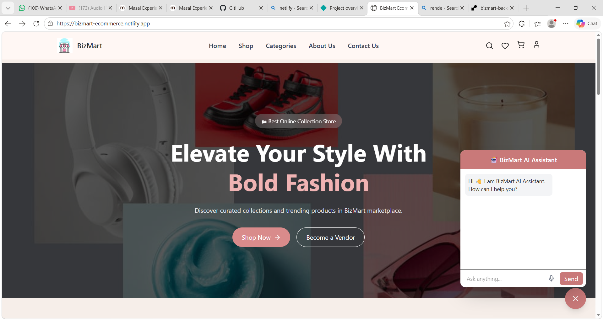

# 🛒 BizMart – Multi Vendor E-Commerce Platform

---

# 📌 Project Title
BizMart – Multi Vendor E-Commerce Platform

---

# 📖 Project Description

BizMart is a modern multi-vendor e-commerce platform designed to help small businesses sell their products online through a centralized digital marketplace.

The platform allows customers to explore products across multiple categories, add items to cart, manage wishlist, and complete purchases through a seamless checkout experience.

BizMart also provides vendor functionality, allowing sellers to manage their products and storefront. The platform focuses on providing a clean UI/UX experience, smooth performance, and real-world e-commerce features.

---

# ✨ Features

### 🛍️ Shopping Features
- Product Browsing by Categories
- Subcategory Navigation
- Product Details Page
- Product Ratings and Reviews
- Add to Cart Functionality
- Wishlist Management
- Product Comparison

### 🔎 Search & Discovery
- Smart Product Search
- Category Based Filtering
- Organized Product Listings

### 👤 User Features
- User Authentication (Login / Signup)
- User Profile Page
- Order History
- Wishlist Management

### 🧑‍💼 Vendor Features
- Vendor Dashboard
- Add New Products
- Manage Products
- Vendor Storefront

### 💳 Checkout System
- Shopping Cart Management
- Checkout Page
- Payment Gateway Integration (Cashfree)

### 🤖 AI Assistant
- AI Chatbot Support
- Voice Input Support
- Smart Product Suggestions

### 🎨 UI / UX
- Fully Responsive Design
- Smooth Page Animations
- Modern E-commerce Interface
- Mobile Friendly Layout

---

# 🛠️ Tech Stack Used

## Frontend
- React.js
- Tailwind CSS
- React Router
- Framer Motion

## Backend
- Node.js
- Express.js

## Database
- Supabase (PostgreSQL)

## Payment Integration
- Cashfree Payment Gateway

## AI Integration
- Google Gemini API

---

# ⚙️ Installation Steps

### 1️⃣ Clone the Repository
git clone https://github.com/Roshani2505/bizmart-frontend.git
cd bizmart-frontend
Copy code

### 2️⃣ Install Dependencies
npm install
Copy code

### 3️⃣ Start Development Server
npm run dev
Copy code

---

# 🌐 Deployment Link

### Frontend Live

https://bizmart-ecommerce.netlify.app/

### Backend API

https://bizmart-backend-evp2.onrender.com

---

# 🔗 Backend API Link
https://bizmart-backend-evp2.onrender.com/api⁠�
Copy code

---

# 🔐 Login Credentials (For Testing)

### Customer Account

Email: test@user.com  
Password: 123456  

### Vendor Account

Email: vendor@test.com  
Password: 123456  

---

# 📸 Screenshots

### 🏠 Login Page

### 🏠 Homepage

### 🛍️ Product Listing Page

### 📦 Product Details Page

### ❤️ Wishlist

### 🛒 Cart Page

### 🤖 AI Chatbot

---

# 🎥 Video Walkthrough

👉 https://drive.google.com/file/d/186wmz_aey04_wjpuawMDRmEAO8aBBnw8/view?usp=sharing

---

# 🚀 Future Improvements

- Real-time Order Tracking
- Advanced Vendor Analytics
- Inventory Management
- Push Notifications
- AI Product Recommendation System
- SaaS Level Vendor Dashboard

---

# 👨‍💻 Developed By

Roshani